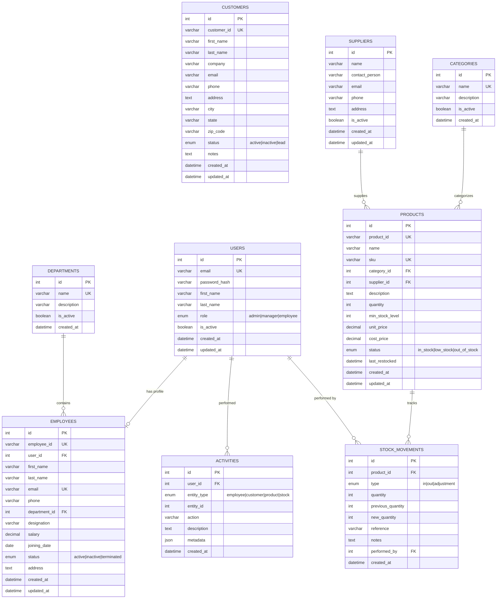

# Database Design

## ER Diagram (Mermaid)

## Relationships

| Parent      | Child           | Relationship | FK Column     |
| ----------- | --------------- | ------------ | ------------- |
| users       | employees       | 1:1          | user_id       |
| departments | employees       | 1:N          | department_id |
| categories  | products        | 1:N          | category_id   |
| suppliers   | products        | 1:N          | supplier_id   |
| products    | stock_movements | 1:N          | product_id    |
| users       | stock_movements | 1:N          | performed_by  |
| users       | activities      | 1:N          | user_id       |

## Indexes Strategy

| Table           | Index                | Type   | Purpose                |
| --------------- | -------------------- | ------ | ---------------------- |
| users           | idx_users_email      | UNIQUE | Login lookup           |
| employees       | idx_emp_employee_id  | UNIQUE | Business ID lookup     |
| employees       | idx_emp_department   | INDEX  | Filter by department   |
| employees       | idx_emp_status       | INDEX  | Filter by status       |
| customers       | idx_cust_customer_id | UNIQUE | Business ID lookup     |
| customers       | idx_cust_email       | INDEX  | Search by email        |
| customers       | idx_cust_company     | INDEX  | Search by company      |
| products        | idx_prod_product_id  | UNIQUE | Business ID lookup     |
| products        | idx_prod_sku         | UNIQUE | SKU lookup             |
| products        | idx_prod_category    | INDEX  | Filter by category     |
| products        | idx_prod_status      | INDEX  | Stock status filter    |
| stock_movements | idx_stock_product    | INDEX  | Product history        |
| stock_movements | idx_stock_created    | INDEX  | Chronological queries  |
| activities      | idx_act_user         | INDEX  | User activity history  |
| activities      | idx_act_entity       | INDEX  | Entity activity lookup |
| activities      | idx_act_created      | INDEX  | Recent activities      |
